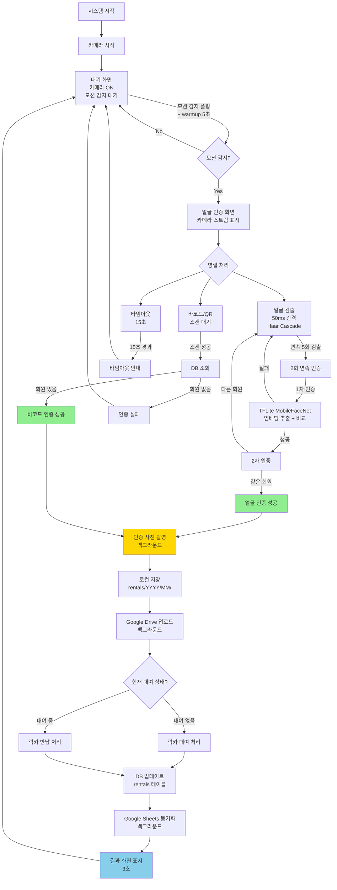

# 락카키 대여기 인증 로직 전체 흐름

## 📊 전체 시스템 다이어그램



---

## 🔄 상세 흐름

### 1️⃣ 대기 상태 (Idle Screen)

```
┌─────────────────────────────────────┐
│         대기 화면                    │
│                                     │
│   "락카키를 스캔해주세요"            │
│                                     │
│   카메라: ON (모션 감지용)           │
│   모션 감지: 폴링 (300ms)           │
│   모션 warmup: 5초                  │
│   모션 threshold: 50,000 픽셀       │
│   바코드: 항상 대기                 │
└─────────────────────────────────────┘
         ↓
    [모션 감지]
         ↓
┌─────────────────────────────────────┐
│      얼굴 인증 화면 전환              │
└─────────────────────────────────────┘
```

**코드:**
```javascript
// home.html
// 카메라 시작 후 5초 딜레이 + 서버 warmup 5초 = 총 10초 후 모션 감지 시작
setTimeout(function() {
    setInterval(async () => {
        const response = await fetch('/api/camera/motion');
        const data = await response.json();
        if (data.motion) {
            navigateTo('face-auth');
        }
    }, 300);
}, 5000);
```

---

### 2️⃣ 얼굴 인증 화면 (Face Auth Screen)

```
┌─────────────────────────────────────┐
│       얼굴 인증 화면                 │
│                                     │
│   ┌───────────────────────┐         │
│   │  [카메라 라이브 뷰]   │         │
│   │   MJPEG 스트림        │         │
│   └───────────────────────┘         │
│                                     │
│   "얼굴 확인 중... (3/5)"           │
│                                     │
│   [연속 검출: 50ms 간격, 5회]       │
│   [2회 연속 인증 필요]              │
│   [바코드/QR: 항상 대기]            │
│   [타임아웃: 15초]                  │
└─────────────────────────────────────┘
```

**2단계 인증 로직:**
```
┌─────────────────────────────────────┐
│ 1단계: 연속 검출 (Haar Cascade)     │
│                                     │
│   50ms마다 /api/face/detect 호출    │
│   연속 5회 검출 → 2단계로           │
│   중간에 실패 → 카운터 리셋         │
└─────────────────────────────────────┘
         ↓ (약 250ms)
┌─────────────────────────────────────┐
│ 2단계: 2회 연속 인증                │
│                                     │
│   1차: /api/auth/face → TEST_FACE   │
│   2차: /api/auth/face → TEST_FACE   │
│   같은 회원 → 인증 성공!            │
│   다른 회원 → 다시 시도             │
└─────────────────────────────────────┘
```

---

### 3️⃣ 얼굴 인식 로직 (현재 구현)

```
┌─────────────────────────────────────┐
│ 검출 단계 (빠름, ~10ms)             │
├─────────────────────────────────────┤
│                                     │
│ /api/face/detect                    │
│     ↓                               │
│ Haar Cascade (OpenCV)               │
│ - scaleFactor: 1.05                 │
│ - minNeighbors: 3                   │
│ - minSize: 40x40                    │
│     ↓                               │
│ {detected: true/false}              │
│                                     │
└─────────────────────────────────────┘

┌─────────────────────────────────────┐
│ 인증 단계 (무거움, ~300-500ms)      │
├─────────────────────────────────────┤
│                                     │
│ /api/auth/face                      │
│     ↓                               │
│ 1. Haar Cascade로 얼굴 검출         │
│     ↓                               │
│ 2. TFLite MobileFaceNet             │
│    - 입력: 112x112 RGB              │
│    - 출력: 128차원 임베딩           │
│     ↓                               │
│ 3. NumPy 코사인 유사도 계산         │
│    for each member:                 │
│      similarity = dot(input, db)    │
│     ↓                               │
│ 4. 최대 유사도 >= 0.5?              │
│    - Yes → member_id 반환           │
│    - No → 인식 실패                 │
│                                     │
└─────────────────────────────────────┘
```

**코드:**
```python
# face_service.py - extract_embedding()

# 1. Haar Cascade로 얼굴 검출
gray = cv2.cvtColor(image, cv2.COLOR_BGR2GRAY)
faces = self.face_cascade.detectMultiScale(gray, ...)

# 2. TFLite MobileFaceNet으로 임베딩 추출
face_rgb = cv2.cvtColor(face_roi, cv2.COLOR_BGR2RGB)
face_resized = cv2.resize(face_rgb, (112, 112))
face_normalized = (face_resized - 127.5) / 128.0
face_input = np.expand_dims(face_normalized, axis=0)

self.embedding_interpreter.set_tensor(input_index, face_input)
self.embedding_interpreter.invoke()
embedding = self.embedding_interpreter.get_tensor(output_index)[0]  # 128D

# 3. 코사인 유사도
similarities = np.dot(self.db_embeddings, embedding / np.linalg.norm(embedding))
best_idx = np.argmax(similarities)

# 4. threshold 비교 (0.5)
if similarities[best_idx] >= 0.5:
    return (self.member_ids[best_idx], similarities[best_idx])
```

---

### 4️⃣ 바코드/QR 인증 로직

```
바코드/QR 스캔
    ↓
시리얼 포트로 데이터 수신
    ↓
바코드 값 파싱
    ↓
DB 조회 (members 테이블)
SELECT * FROM members 
WHERE barcode = ? OR qr_code = ?
    ↓
회원 존재?
    ├─ No → 인증 실패
    └─ Yes
        ↓
    회원 상태 확인
    (status = 'active', expiry_date)
        ↓
    유효?
        ├─ No → 만료 안내
        └─ Yes → 인증 성공!
            ↓
        member_id 반환
```

---

### 5️⃣ 인증 사진 촬영 (모든 인증 시)

```
인증 성공 (얼굴/바코드/QR/NFC)
    ↓
백그라운드 스레드 시작
    ↓
카메라 스냅샷 촬영
    ↓
로컬 저장
instance/photos/rentals/
    └── 2025/
        └── 12/
            └── M001_20251216_103000.jpg
    ↓
Google Drive 업로드 (비동기)
    ↓
DB 업데이트 (rentals 테이블)
    ↓
완료 (메인 흐름은 계속)
```

---

## 🔢 처리 시간 (실측)

| 단계 | 시간 | 비고 |
|------|------|------|
| **모션 감지 warmup** | 5초 | 카메라 안정화 |
| **얼굴 검출 (Haar)** | ~10ms | /api/face/detect |
| **연속 5회 검출** | ~250ms | 50ms × 5 |
| **1차 인증** | 300-500ms | TFLite MobileFaceNet |
| **2차 인증** | 300-500ms | TFLite MobileFaceNet |
| **전체 (얼굴)** | **~850-1200ms** | 검출 + 2회 인증 |
| **바코드 스캔** | 즉시 | 가장 빠름 |
| **인증 사진** | 백그라운드 | 메인 흐름 차단 안 함 |
| **Drive 업로드** | 백그라운드 | 1-3초 |

---

## 🧠 얼굴 인식 기술 스택

| 구성요소 | 기술 | 설명 |
|----------|------|------|
| **얼굴 검출** | Haar Cascade (OpenCV) | 빠름 (~10ms), 가벼움 |
| **얼굴 임베딩** | TFLite MobileFaceNet | 128차원, 라즈베리파이 최적화 |
| **유사도 계산** | NumPy dot product | 코사인 유사도 |
| **임계값** | 0.5 (50%) | 테스트 결과 0.65~0.75 나옴 |
| **라이선스** | Apache 2.0 / MIT | 상업적 사용 가능 |

---

## 💾 저장소별 데이터

| 데이터 | SQLite | 로컬 파일 | Google Drive | Google Sheets |
|--------|--------|----------|--------------|--------------|
| **face_embedding** | ✅ BLOB | ✅ .pkl | ✅ .pkl | ❌ |
| **face_photo** | ✅ URL | ✅ .jpg | ✅ .jpg | ✅ URL |
| **rental_photo** | ✅ URL | ✅ .jpg | ✅ .jpg | ✅ URL |
| **member_info** | ✅ | ❌ | ❌ | ✅ |
| **rental_record** | ✅ | ❌ | ❌ | ✅ |

---

## 🎯 인증 방법별 비교

| 항목 | 얼굴 인식 | 바코드 | QR | NFC |
|------|----------|--------|-----|-----|
| **속도** | ~1초 | 0.1초 | 0.1초 | 0.1초 |
| **정확도** | 2회 인증 | 99%+ | 99%+ | 99%+ |
| **편의성** | ⭐⭐⭐⭐⭐ | ⭐⭐⭐ | ⭐⭐⭐ | ⭐⭐⭐⭐ |
| **카드 필요** | ❌ | ✅ | ✅ | ✅ |
| **등록 필요** | ✅ 필수 | ✅ 필수 | ✅ 필수 | ✅ 필수 |
| **인증 사진** | ✅ | ✅ | ✅ | ✅ |

---

## 📌 핵심 포인트

1. **2단계 인증 (높은 정확도)**
   - 1단계: Haar Cascade로 빠른 검출 (5회 연속)
   - 2단계: TFLite로 2회 연속 인증 (같은 회원 확인)

2. **모든 인증 방법 병렬 처리**
   - 얼굴 인식 시도 중에도 바코드 스캔 가능
   - 먼저 성공한 것으로 인증

3. **모든 인증 시 사진 촬영**
   - 부정 이용자 확인용
   - 백그라운드 처리로 속도 영향 없음

4. **3중 백업 시스템**
   - 로컬 DB (실시간)
   - 로컬 파일 (백업)
   - Google Drive (중앙 백업)

5. **비동기 처리**
   - 사진 촬영: 백그라운드
   - Drive 업로드: 백그라운드
   - Sheets 동기화: 주기적
   - → 메인 흐름 빠르게 유지

---

## 📅 업데이트 이력

| 날짜 | 변경 내용 |
|------|----------|
| 2025-12-16 | 얼굴 인식 기술 스택 변경: MediaPipe → Haar + TFLite MobileFaceNet |
| 2025-12-16 | 임베딩 차원: 1404D → 128D |
| 2025-12-16 | 유사도 threshold: 0.85 → 0.5 |
| 2025-12-16 | 2회 연속 인증 로직 추가 (정확도 향상) |
| 2025-12-16 | 검출 API 분리 (/api/face/detect) |
| 2025-12-16 | 모션 감지 개선 (warmup 5초, threshold 50K) |
| 2025-12-17 | 모션 감지 최적화 (10fps, 160x120 저해상도) - CPU 100% → 18% |
| 2025-12-17 | auth_method 명시적 전달 (프론트→백엔드) |
| 2025-12-17 | 인증 사진 촬영 시점 변경 (/member-check에서 rental 생성 후) |

---

## 🔧 기술 부채: 인증 사진 촬영 로직

### 현재 상황 (2025-12-17)

**문제:**
- 기존에 `/api/barcode/process`, `/api/auth/face`에서 `_capture_auth_photo()` 호출
- 이 시점에는 rental이 아직 생성되지 않음
- 결과: 사진이 이전 rental에 연결되거나 누락됨

**임시 해결책 (옵션 B 적용):**
```
1. /api/barcode/process, /api/auth/face → 사진 촬영 제거
2. /member-check 라우트에서 pending rental 생성 직후 _capture_auth_photo() 호출
3. 이제 rental이 존재하므로 사진이 올바르게 연결됨
```

**장점:**
- 최소한의 변경 (1개 파일)
- 기존 로직 영향 적음
- 바코드/얼굴/NFC 모두 동일하게 처리

**단점:**
- 사진 촬영이 페이지 렌더링 시점에 의존
- API와 페이지 로직이 결합됨

### 향후 통일 방안 (옵션 A)

**목표:** 사진 경로를 명시적으로 전달하여 rental과 함께 저장

```
1. /api/barcode/process, /api/auth/face
   → 사진 촬영 + photo_path 반환

2. 프론트엔드 navigateTo()
   → photo_path를 파라미터로 전달

3. /member-check 라우트
   → photo_path 받아서 템플릿에 전달

4. /api/rentals/process
   → rental 생성/업데이트 시 photo_path 함께 INSERT/UPDATE
```

**변경 필요 파일:**
| 파일 | 변경 내용 |
|------|----------|
| `app/api/routes.py` | 사진 촬영 후 photo_path 반환 |
| `app/templates/pages/face_auth.html` | navigateTo에 photo_path 추가 |
| `app/templates/pages/home.html` | navigateTo에 photo_path 추가 |
| `app/main/routes.py` | photo_path 파라미터 처리 |
| `app/templates/pages/member_check.html` | photo_path 전달 |
| `app/api/routes.py` | /api/rentals/process에서 photo_path 저장 |

**우선순위:** 중간 (현재 동작에 문제 없음, 리팩토링 시 적용)

---

**이 문서는 전체 시스템의 로직 흐름을 설명합니다.**
