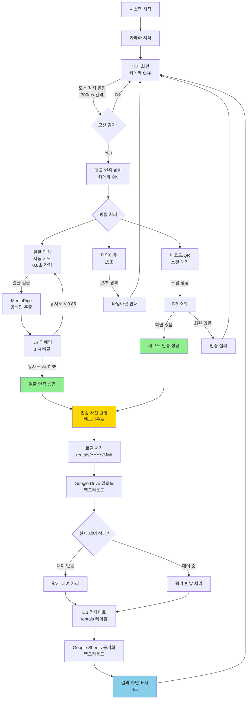

# 락카키 대여기 인증 로직 전체 흐름

## 📊 전체 시스템 다이어그램



---

## 🔄 상세 흐름

### 1️⃣ 대기 상태 (Idle Screen)

```
┌─────────────────────────────────────┐
│         대기 화면                    │
│                                     │
│   "락카키를 스캔해주세요"            │
│                                     │
│   카메라: OFF (절전)                │
│   모션 감지: 폴링 (300ms)           │
│   바코드: 항상 대기                 │
└─────────────────────────────────────┘
         ↓
    [모션 감지]
         ↓
┌─────────────────────────────────────┐
│      얼굴 인증 화면 전환              │
└─────────────────────────────────────┘
```

**코드:**
```javascript
// home.html
setInterval(async () => {
    if (currentState === 'idle') {
        const response = await fetch('/api/camera/motion');
        const data = await response.json();
        if (data.motion) {
            navigateTo('face-auth');  // 자동 전환
        }
    }
}, 300);
```

---

### 2️⃣ 얼굴 인증 화면 (Face Auth Screen)

```
┌─────────────────────────────────────┐
│       얼굴 인증 화면                 │
│                                     │
│   ┌───────────────────────┐         │
│   │  [카메라 라이브 뷰]   │         │
│   │   MJPEG 스트림        │         │
│   └───────────────────────┘         │
│                                     │
│   "얼굴을 인식해주세요"              │
│                                     │
│   [자동 얼굴 인식: 0.8초 간격]       │
│   [바코드/QR: 항상 대기]            │
│   [타임아웃: 15초]                  │
└─────────────────────────────────────┘
```

**병렬 처리:**
```
┌─────────────┐  ┌─────────────┐  ┌─────────────┐
│  얼굴 인식   │  │  바코드     │  │  타임아웃    │
│  (자동)     │  │  (대기)     │  │  (15초)     │
└──────┬──────┘  └──────┬──────┘  └──────┬──────┘
       │                │                │
       └────────────────┼────────────────┘
                        ↓
                   [먼저 성공한 것]
```

---

### 3️⃣ 얼굴 인식 로직

```
카메라 촬영 (스냅샷)
    ↓
MediaPipe Face Detection
    ↓
얼굴 검출 성공?
    ├─ No → 재시도 (0.8초 후)
    └─ Yes
        ↓
MediaPipe Face Mesh
    ↓
478개 랜드마크 추출
    ↓
1404차원 임베딩 생성
    ↓
DB에서 모든 임베딩 로드
    ↓
NumPy 코사인 유사도 계산
for each member:
    similarity = cosine_similarity(input, db_embedding)
    ↓
최대 유사도 >= 0.85?
    ├─ No → 인식 실패 → 재시도
    └─ Yes → 회원 식별 성공!
        ↓
    member_id 반환
```

**코드:**
```python
# face_service.py - authenticate_by_face()

# 1. 임베딩 추출
embedding = self.extract_embedding(image)

# 2. DB 임베딩과 비교
similarities = np.dot(self.db_embeddings, embedding)

# 3. 최대 유사도
max_idx = np.argmax(similarities)
max_similarity = similarities[max_idx]

# 4. 임계값 비교
if max_similarity >= threshold:  # 0.85
    member_id = self.member_ids[max_idx]
    return (member_id, max_similarity)
else:
    return None
```

---

### 4️⃣ 바코드/QR 인증 로직

```
바코드/QR 스캔
    ↓
시리얼 포트로 데이터 수신
    ↓
바코드 값 파싱
    ↓
DB 조회 (members 테이블)
SELECT * FROM members 
WHERE barcode = ? OR qr_code = ?
    ↓
회원 존재?
    ├─ No → 인증 실패
    └─ Yes
        ↓
    회원 상태 확인
    (status = 'active', expiry_date)
        ↓
    유효?
        ├─ No → 만료 안내
        └─ Yes → 인증 성공!
            ↓
        member_id 반환
```

**코드:**
```python
# api/routes.py - /barcode/process

# 1. DB 조회
cursor = db.execute_query("""
    SELECT * FROM members 
    WHERE barcode = ? OR qr_code = ?
""", (barcode_value, barcode_value))

# 2. 회원 확인
if not member:
    return {'success': False, 'error': '등록되지 않은 회원'}

# 3. 상태 확인
if member['status'] != 'active':
    return {'success': False, 'error': '비활성 회원'}

# 4. 만료일 확인
if expiry_date < today:
    return {'success': False, 'error': '회원권 만료'}

# 5. 인증 성공
return {'success': True, 'member_id': member_id}
```

---

### 5️⃣ 인증 사진 촬영 (모든 인증 시)

```
인증 성공 (얼굴/바코드/QR/NFC)
    ↓
백그라운드 스레드 시작
    ↓
카메라 스냅샷 촬영
    ↓
로컬 저장
instance/photos/rentals/
    └── 2025/
        └── 12/
            └── M001_20251215_103000.jpg
    ↓
Google Drive 업로드 (비동기)
    ↓
URL 받기
    ↓
DB 업데이트 (rentals 테이블)
UPDATE rentals 
SET rental_photo_path = ?,
    rental_photo_url = ?,
    auth_method = ?
WHERE member_id = ? AND status = 'active'
    ↓
완료 (메인 흐름은 계속)
```

**코드:**
```python
# api/routes.py - _capture_auth_photo()

def _capture_auth_photo(member_id: str, auth_method: str):
    def capture_async():
        # 1. 스냅샷
        photo_path = camera.capture_snapshot(...)
        
        # 2. Drive 업로드
        photo_url = drive.upload_file(...)
        
        # 3. DB 업데이트
        db.execute_query("""
            UPDATE rentals 
            SET rental_photo_path = ?,
                rental_photo_url = ?,
                auth_method = ?
            WHERE member_id = ? AND status IN ('active', 'pending')
        """, (photo_path, photo_url, auth_method, member_id))
    
    # 백그라운드 실행
    threading.Thread(target=capture_async, daemon=True).start()
```

---

### 6️⃣ 대여/반납 처리

```
인증 성공 + member_id
    ↓
현재 대여 상태 확인
SELECT * FROM rentals 
WHERE member_id = ? AND status = 'active'
    ↓
대여 중?
    ├─ No → 대여 처리
    │   ↓
    │   사용 가능한 락카 조회
    │   ↓
    │   rentals 테이블에 INSERT
    │   (rental_id, member_id, locker_number,
    │    auth_method, rental_photo_path, 
    │    rental_photo_url, created_at)
    │   ↓
    │   locker_status 업데이트
    │   ↓
    │   "대여 완료" 화면
    │
    └─ Yes → 반납 처리
        ↓
        rentals 테이블 UPDATE
        (return_sensor_time, status = 'returned')
        ↓
        locker_status 업데이트
        (current_member = NULL)
        ↓
        "반납 완료" 화면
```

---

### 7️⃣ Google Sheets 동기화

```
DB 업데이트 완료
    ↓
백그라운드 동기화 (5분마다 자동)
    ↓
┌─────────────────────────────────────┐
│  sheets_sync.py                     │
├─────────────────────────────────────┤
│                                     │
│  upload_rentals()                   │
│  - rental_id                        │
│  - member_id                        │
│  - locker_number                    │
│  - auth_method         ← 🆕         │
│  - rental_photo_path   ← 🆕         │
│  - rental_photo_url    ← 🆕         │
│                                     │
│  upload_rental_photos()             │
│  - 인증사진 시트 업로드              │
│                                     │
└─────────────────────────────────────┘
```

---

## 🎨 UI 화면 전환 흐름

```
┌──────────────┐
│  대기 화면    │
│  (Idle)      │
└──────┬───────┘
       │ 모션 감지
       ↓
┌──────────────┐
│ 얼굴 인증     │
│ (Face Auth)  │
└──────┬───────┘
       │ 인증 성공
       ↓
┌──────────────┐
│ 처리 중       │
│ (Processing) │
└──────┬───────┘
       │
       ├─→ 대여 성공
       │   ┌──────────────┐
       │   │ 대여 완료     │
       │   │ (Rental OK)  │
       │   └──────┬───────┘
       │
       └─→ 반납 성공
           ┌──────────────┐
           │ 반납 완료     │
           │ (Return OK)  │
           └──────┬───────┘
                  │ 3초 후
                  ↓
           ┌──────────────┐
           │  대기 화면    │
           └──────────────┘
```

---

## 📊 데이터 흐름

```
┌─────────────────────────────────────────────────────────┐
│                    얼굴 등록 (최초 1회)                   │
└─────────────────────────────────────────────────────────┘
카메라 촬영
    ↓
MediaPipe 분석
    ├─→ 임베딩 (1404차원)
    │       ↓
    │   ┌─────────────────┐
    │   │ DB (BLOB)       │  ← 실시간 인식용
    │   ├─────────────────┤
    │   │ 로컬 .pkl       │  ← 백업용
    │   ├─────────────────┤
    │   │ Drive .pkl      │  ← 중앙 백업
    │   └─────────────────┘
    │
    └─→ 사진 (.jpg)
            ↓
        ┌─────────────────┐
        │ 로컬 .jpg       │
        ├─────────────────┤
        │ Drive .jpg      │
        ├─────────────────┤
        │ DB (URL)        │
        ├─────────────────┤
        │ Sheets (URL)    │
        └─────────────────┘

┌─────────────────────────────────────────────────────────┐
│                    인증 시 (매번)                        │
└─────────────────────────────────────────────────────────┘
카메라 촬영 (인증용)
    ↓
MediaPipe 분석 → 임베딩
    ↓
DB 임베딩과 비교 → 회원 식별
    ↓
인증 사진 촬영 (백그라운드)
    ↓
┌─────────────────┐
│ 로컬 .jpg       │
├─────────────────┤
│ Drive .jpg      │
├─────────────────┤
│ DB (URL)        │
├─────────────────┤
│ Sheets (URL)    │
└─────────────────┘
```

---

## 🔢 처리 시간 (예상)

| 단계 | 시간 | 비고 |
|------|------|------|
| **모션 감지** | 300ms | 폴링 간격 |
| **얼굴 검출** | 50-100ms | MediaPipe |
| **임베딩 추출** | 100-200ms | MediaPipe |
| **1:N 검색** | 10-50ms | NumPy (100명 기준) |
| **바코드 스캔** | 즉시 | 시리얼 |
| **DB 조회** | 10-20ms | SQLite |
| **인증 사진** | 백그라운드 | 메인 흐름 차단 안 함 |
| **Drive 업로드** | 백그라운드 | 1-3초 |
| **전체 (얼굴)** | 0.5-1초 | 사용자 체감 |
| **전체 (바코드)** | 0.1-0.2초 | 가장 빠름 |

---

## 💾 저장소별 데이터

| 데이터 | SQLite | 로컬 파일 | Google Drive | Google Sheets |
|--------|--------|----------|--------------|--------------|
| **face_embedding** | ✅ BLOB | ✅ .pkl | ✅ .pkl | ❌ |
| **face_photo** | ✅ URL | ✅ .jpg | ✅ .jpg | ✅ URL |
| **rental_photo** | ✅ URL | ✅ .jpg | ✅ .jpg | ✅ URL |
| **member_info** | ✅ | ❌ | ❌ | ✅ |
| **rental_record** | ✅ | ❌ | ❌ | ✅ |

---

## 🎯 인증 방법별 비교

| 항목 | 얼굴 인식 | 바코드 | QR | NFC |
|------|----------|--------|-----|-----|
| **속도** | 0.5-1초 | 0.1초 | 0.1초 | 0.1초 |
| **정확도** | 85%+ | 99%+ | 99%+ | 99%+ |
| **편의성** | ⭐⭐⭐⭐⭐ | ⭐⭐⭐ | ⭐⭐⭐ | ⭐⭐⭐⭐ |
| **카드 필요** | ❌ | ✅ | ✅ | ✅ |
| **등록 필요** | ✅ 필수 | ✅ 필수 | ✅ 필수 | ✅ 필수 |
| **인증 사진** | ✅ | ✅ | ✅ | ✅ |

---

## 📌 핵심 포인트

1. **모든 인증 방법 병렬 처리**
   - 얼굴 인식 시도 중에도 바코드 스캔 가능
   - 먼저 성공한 것으로 인증

2. **모든 인증 시 사진 촬영**
   - 부정 이용자 확인용
   - 백그라운드 처리로 속도 영향 없음

3. **3중 백업 시스템**
   - 로컬 DB (실시간)
   - 로컬 파일 (백업)
   - Google Drive (중앙 백업)

4. **비동기 처리**
   - 사진 촬영: 백그라운드
   - Drive 업로드: 백그라운드
   - Sheets 동기화: 주기적
   - → 메인 흐름 빠르게 유지

---

**이 문서는 전체 시스템의 로직 흐름을 설명합니다.**

