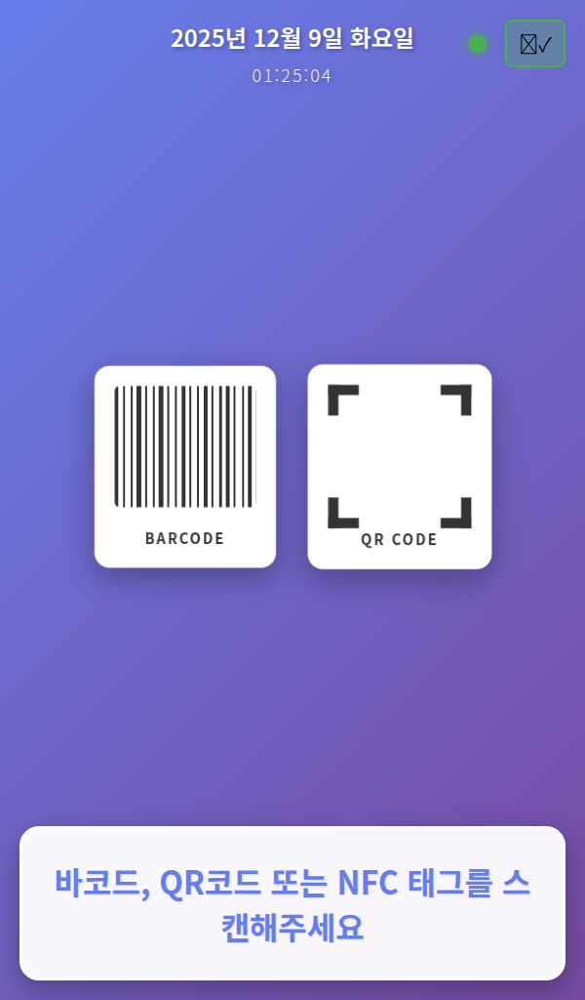
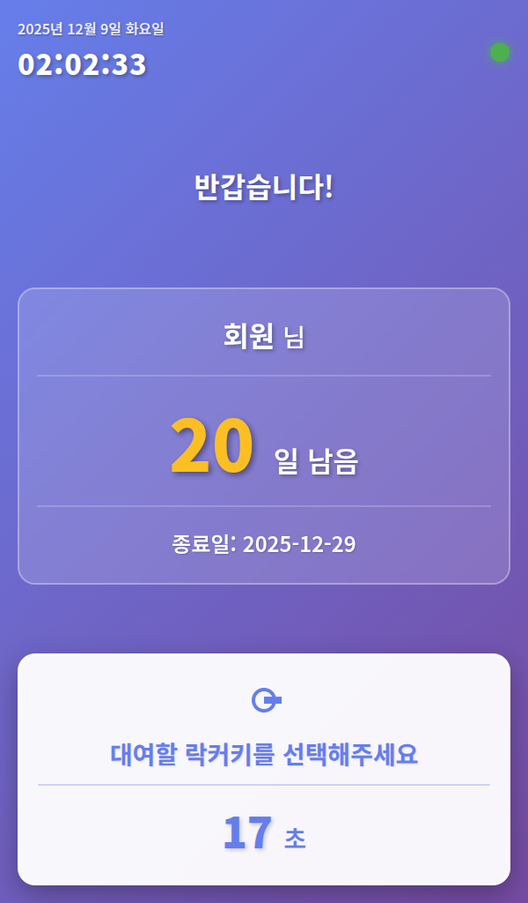
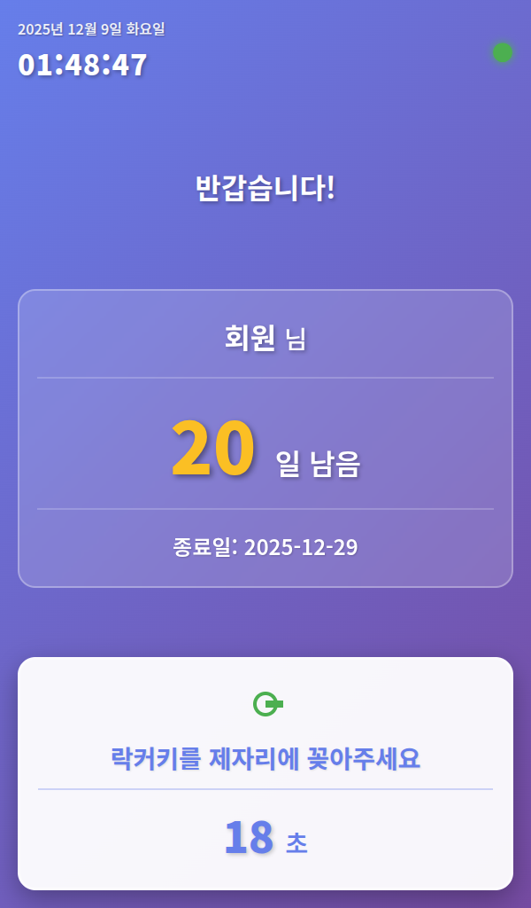
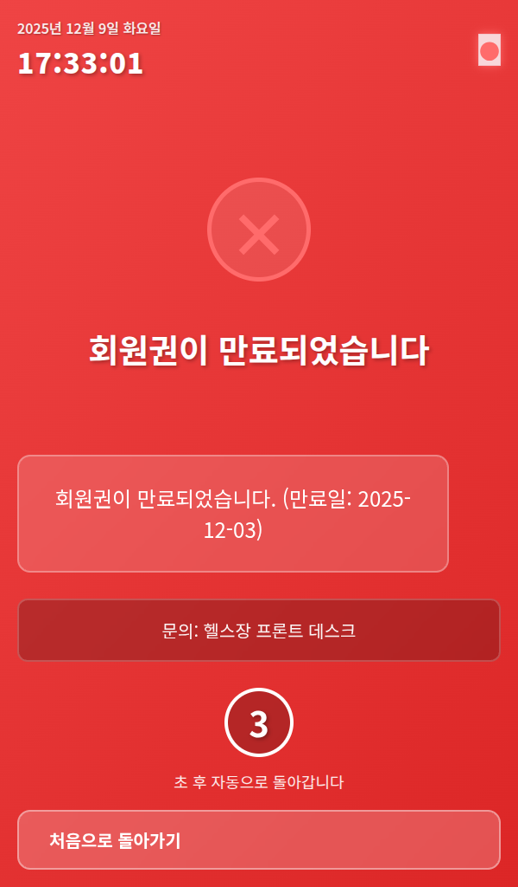
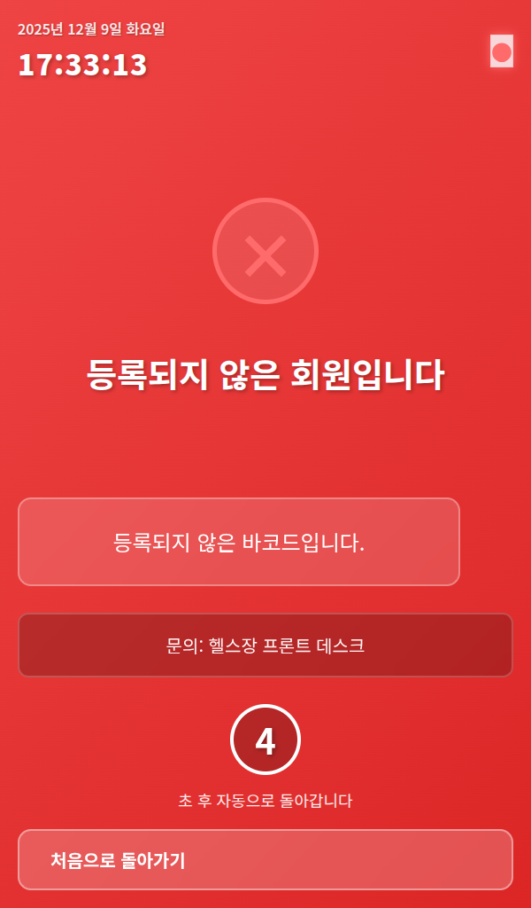
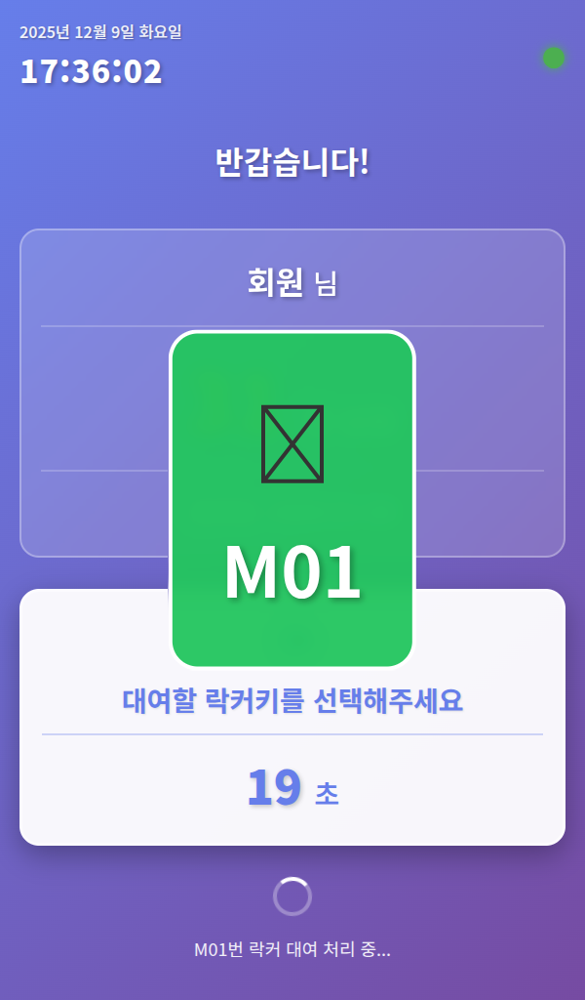
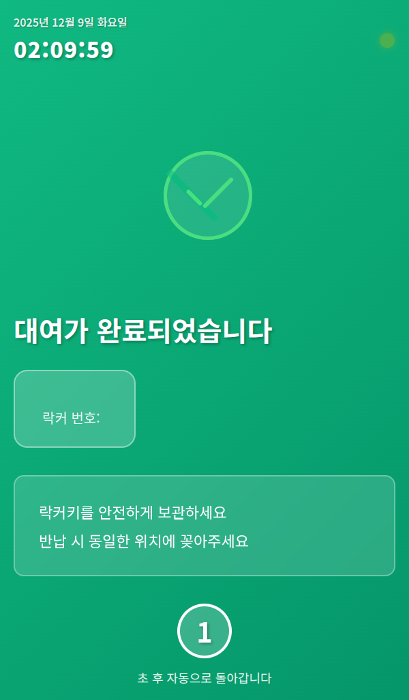
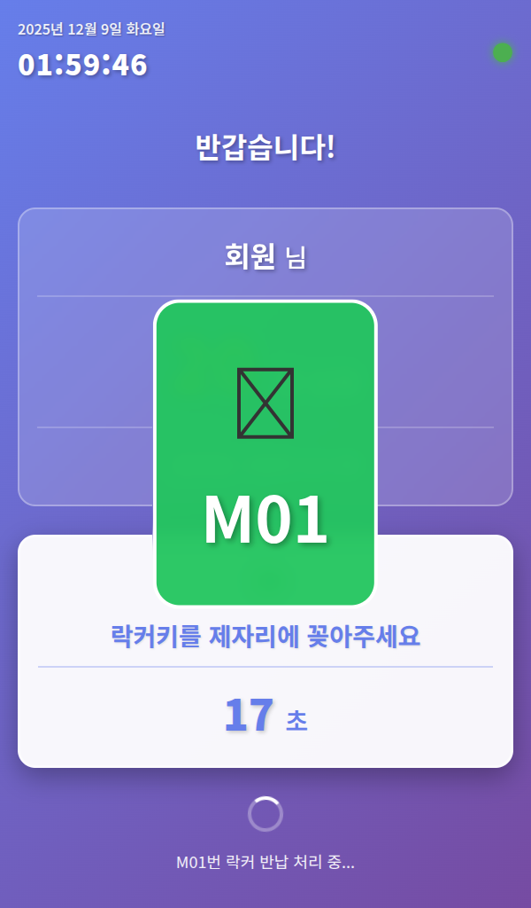
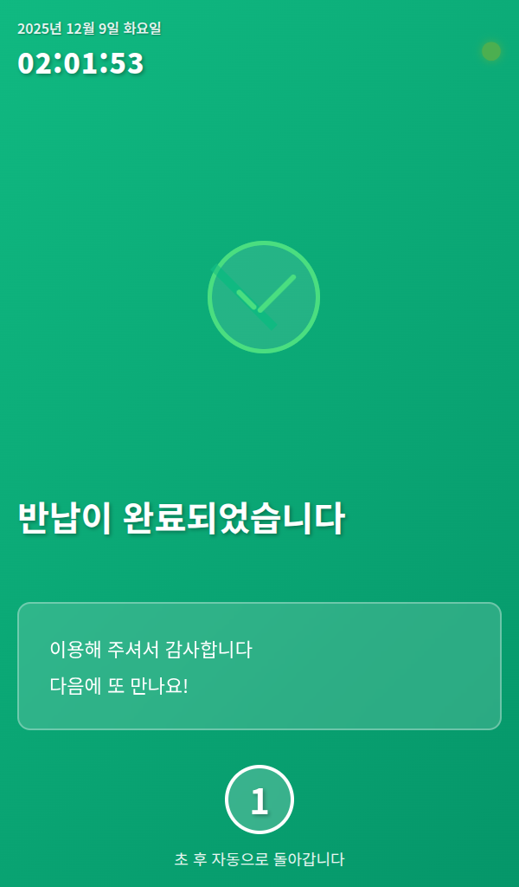

# 키오스크 UI 플로우 가이드

> 락카키 대여기 시스템의 전체 화면 플로우 및 사용자 경험

## 개요

이 문서는 키오스크 화면의 전체 플로우와 각 단계별 화면을 설명합니다.

---

## 1. 대기 화면 (Home)



**설명:**
- 시스템의 기본 대기 화면
- "바코드를 스캔해주세요" 메시지 표시
- 회원 바코드 입력 대기 중

**다음 단계:** 바코드 스캔 → 회원 인증

---

## 2. 회원 인증

### 2-1. 유효한 회원

#### 대여 모드 (락커 사용 안 함)



**설명:**
- 유효한 회원 바코드 인식
- "대여할 락커키를 선택해주세요" 메시지
- 문 자동 열림
- 20초 카운트다운 시작

**조건:**
- 이용권이 유효함
- 현재 대여 중인 락커 없음

#### 반납 모드 (락커 사용 중)



**설명:**
- 유효한 회원 바코드 인식
- "락커키를 제자리에 꽂아주세요" 메시지
- 대여 중인 락커 번호 표시 (예: M01)
- 문 자동 열림
- 20초 카운트다운 시작

**조건:**
- 이용권이 유효함
- 현재 대여 중인 락커 있음

---

### 2-2. 이용권 만료



**설명:**
- 만료된 이용권 회원 바코드 인식
- "이용권이 만료되었습니다" 오류 메시지 표시
- 만료일자 안내
- 3초 후 자동으로 대기 화면으로 복귀

**조건:**
- 회원 등록되어 있음
- 이용권 만료일이 오늘 이전

---

### 2-3. 미등록 회원



**설명:**
- 등록되지 않은 바코드 인식
- "등록되지 않은 회원입니다" 오류 메시지 표시
- 관리자 문의 안내
- 3초 후 자동으로 대기 화면으로 복귀

**조건:**
- 데이터베이스에 해당 바코드 없음

---

## 3. 대여 프로세스

### 3-1. 락커 선택 대기


**단계:**
1. 회원 바코드 인식
2. 문 자동 열림
3. "대여할 락커키를 선택해주세요" 안내
4. 센서 감지 대기 (20초)

---

### 3-2. 센서 감지 (키 제거)



**설명:**
- 회원이 락커키를 선택하여 제거
- IR 센서가 키 제거 감지 (HIGH 신호)
- "M01번 락커 대여 처리 중..." 메시지
- 데이터베이스 업데이트 진행

**센서 상태:** `HIGH` (키 없음)

**처리 내용:**
- `rentals` 테이블에 대여 기록 생성
- `members.currently_renting` 업데이트
- `locker_status` 업데이트

---

### 3-3. 대여 완료



**설명:**
- 대여 처리 완료
- "대여가 완료되었습니다" 안내
- 대여된 락커 번호 표시
- 문 자동 닫힘
- 3초 후 대기 화면으로 복귀

**처리 완료:**
- DB에 대여 기록 저장
- 회원에게 락커 할당
- Google Sheets 동기화 대기열 추가

---

## 4. 반납 프로세스

### 4-1. 락커 반납 대기


**단계:**
1. 회원 바코드 인식 (대여 중인 회원)
2. 문 자동 열림
3. "락커키를 제자리에 꽂아주세요" 안내
4. 대여 중인 락커 번호 표시 (M01)
5. 센서 감지 대기 (20초)

---

### 4-2. 센서 감지 (키 삽입)



**설명:**
- 회원이 락커키를 제자리에 꽂음
- IR 센서가 키 삽입 감지 (LOW 신호)
- "M01번 락커 반납 처리 중..." 메시지
- 데이터베이스 업데이트 진행

**센서 상태:** `LOW` (키 있음)

**처리 내용:**
- `rentals` 테이블에 반납 시각 기록
- `members.currently_renting` NULL로 설정
- `locker_status` 업데이트

---

### 4-3. 반납 완료



**설명:**
- 반납 처리 완료
- "반납이 완료되었습니다" 안내
- 반납된 락커 번호 표시
- 문 자동 닫힘
- 3초 후 대기 화면으로 복귀

**처리 완료:**
- DB에 반납 시각 기록
- 회원 락커 할당 해제
- 락커 상태 초기화
- Google Sheets 동기화 대기열 추가

---

## 5. 화면 플로우 다이어그램

```
┌─────────────────┐
│   대기 화면     │ (kiosk_screen.png)
│ 바코드 스캔 대기 │
└────────┬────────┘
         │ [바코드 스캔]
         ↓
    ┌────────────┐
    │  회원 인증  │
    └─────┬──────┘
          │
    ┌─────┼─────┬─────────┐
    │     │     │         │
    ↓     ↓     ↓         ↓
  만료  미등록  대여중?    대여중X
  (만료) (미등록)  │        │
    ↓     ↓      ↓        ↓
  오류  오류   [반납]    [대여]
         ↓               ↓
    반납대기          대여대기
    (return_wait)    (rental_wait)
         ↓               ↓
    센서감지(LOW)     센서감지(HIGH)
    (return_proc)    (rental_proc)
         ↓               ↓
    반납완료          대여완료
    (return_complete) (rental_complete)
         ↓               ↓
         └───────┬───────┘
                 ↓
            [대기 화면]
```

---

## 6. 타이밍 및 제약사항

### 타임아웃
- **센서 감지 대기**: 20초
  - 20초 내 센서 변화 없으면 자동으로 대기 화면 복귀
  - 문 자동 닫힘

### 화면 전환
- **완료 화면**: 3초 후 자동으로 대기 화면
- **오류 화면**: 3초 후 자동으로 대기 화면

### 문 제어
- **열림 조건**: 회원 인증 성공 시 자동 열림
- **닫힘 조건**: 
  - 대여/반납 완료 시
  - 타임아웃 시
  - 오류 발생 시

---

## 7. 센서 상태

| 상태 | 의미 | 용도 |
|------|------|------|
| `HIGH` | 키 없음 (뽑힘) | 대여 감지 |
| `LOW` | 키 있음 (꽂힘) | 반납 감지 |

---

## 8. 스크린샷 목록

| 파일명 | 설명 |
|--------|------|
| `kiosk_screen.png` | 대기 화면 |
| `member_expired.png` | 이용권 만료 오류 |
| `member_notfound.png` | 미등록 회원 오류 |
| `rental_wait.png` | 대여 대기 (락커 선택) |
| `rental_processing.png` | 대여 센서 감지 중 |
| `rental_complete.png` | 대여 완료 |
| `return_wait.png` | 반납 대기 (키 꽂기) |
| `return_processing.png` | 반납 센서 감지 중 |
| `return_complete.png` | 반납 완료 |

---

**작성일**: 2024-12-09  
**스크린샷 촬영**: 라즈베리파이 키오스크 (600x1024 세로모드)

