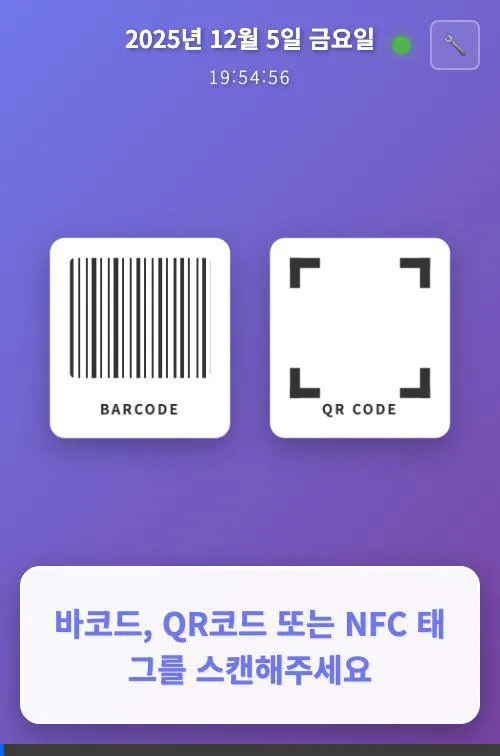
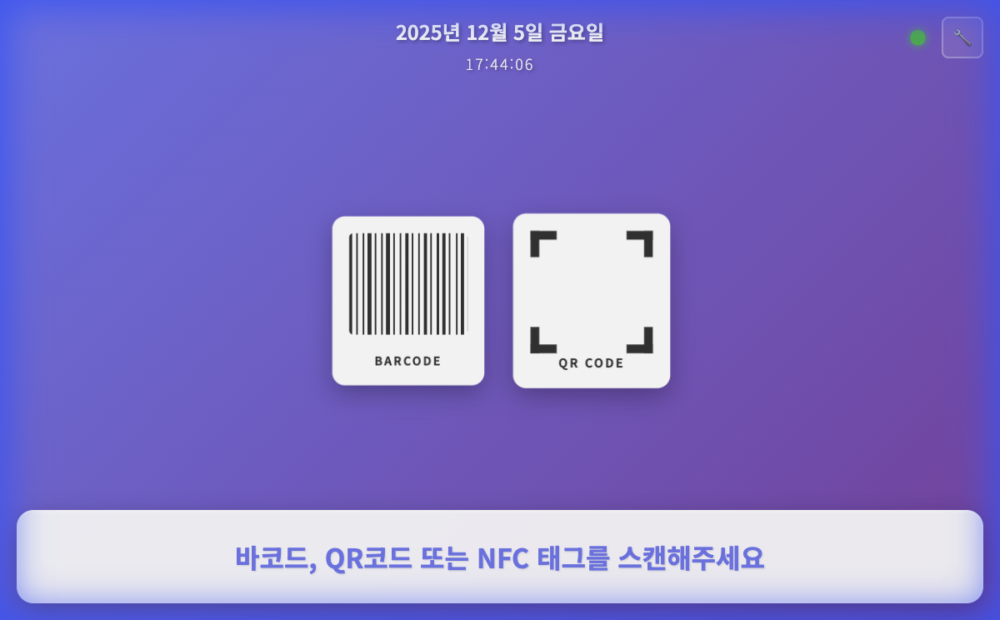
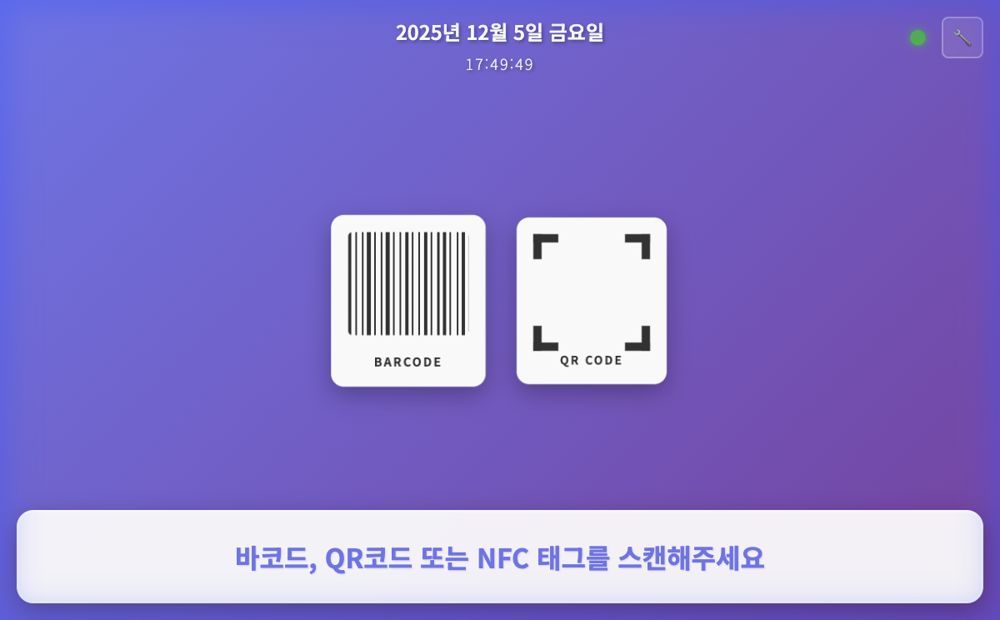

# 🎨 UI/UX 가이드

이 문서는 헬스장 락커 시스템의 사용자 인터페이스(UI)와 사용자 흐름(UX)을 설명합니다.

## 🎥 동작 영상

시스템의 실제 동작 흐름을 영상으로 확인할 수 있습니다.

### 1. 정상 대여 프로세스 (Normal Rental)

*홈 화면 -> 회원 확인(대여) -> 대여 완료 -> (자동 복귀)*

### 2. 정상 반납 프로세스 (Normal Return)

*홈 화면 -> 회원 확인(반납) -> 반납 완료 -> (자동 복귀)*

### 3. 오류 발생 프로세스 (Error Case)

*홈 화면 -> 오류 화면(만료/미등록 등) -> (자동 복귀)*

## 📱 주요 화면

### 1. 홈 화면 (대기 화면)

사용자가 키오스크에 접근했을 때 가장 먼저 보게 되는 화면입니다.

**기능:**
- **날짜/시간 표시**: 상단에 현재 날짜와 시간이 표시됩니다.
- **바코드 스캔 대기**: 중앙의 일러스트는 시스템이 스캔을 기다리고 있음을 나타냅니다.
- **상태 표시**: 하단에 시스템 연결 상태가 표시됩니다.

**사용자 행동:**
- 회원 바코드를 스캐너에 태깅하거나 QR코드를 인식시킵니다.

### 2. 회원 확인 화면

바코드를 스캔하면 나타나는 화면입니다. 회원의 정보와 현재 상태를 보여줍니다.

*(참고: 위 스크린샷은 테스트 환경에서 캡처된 것으로, 실제 데이터와 다를 수 있습니다.)*

**기능:**
- **회원 정보**: 이름, 회원번호, 회원권 상태 등을 표시합니다.
- **자동 진행**: 일정 시간 후 자동으로 다음 단계(락커 선택 또는 반납)로 넘어갑니다.

## ⚠️ 준비 중인 화면

현재 다음 화면들은 시스템 업데이트(템플릿 추가)가 필요하여 스크린샷을 제공할 수 없습니다.

### 3. 락커 선택 화면
- **상태**: 템플릿 파일 누락 (`locker_select.html`)
- **기능**: 사용자가 원하는 구역의 빈 락커를 터치하여 선택하는 화면입니다.

### 4. 대여/반납 완료 화면
- **상태**: 자동 리다이렉트로 인한 캡처 불가
- **기능**: 대여 또는 반납이 완료되었음을 알리고, 3초 후 자동으로 홈 화면으로 복귀합니다.

### 5. 오류 화면
- **상태**: 자동 리다이렉트로 인한 캡처 불가
- **기능**: 시스템 오류나 사용자 실수 등을 알리고, 5초 후 자동으로 홈 화면으로 복귀합니다.

### 6. 관리자 대시보드
- **상태**: 템플릿 파일 누락 (`admin.html`)
- **기능**: 시스템 상태 모니터링, 강제 문 열기 등 관리 기능을 제공하는 화면입니다.
